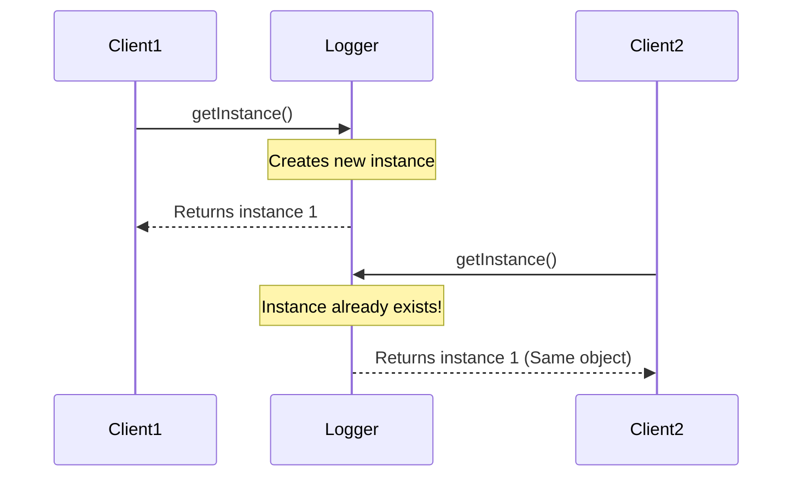

# 📐 Module 1 — Design Patterns and Principles

> **In simple words:** Design patterns are like recipes. Just like a chef doesn't invent a new way to boil water every time, programmers use proven solutions (patterns) to solve common problems. This module taught me 11 such recipes.

## 📑 Table of Contents
- [Why Should You Care About Design Patterns?](#-why-should-you-care-about-design-patterns)
- [What I Built (Exercise by Exercise)](#-what-i-built-exercise-by-exercise)
  - [Creational Patterns](#-creational-patterns--how-to-create-objects-smartly)
  - [Structural Patterns](#-structural-patterns--how-to-connect-objects-together)
  - [Behavioral Patterns](#-behavioral-patterns--how-objects-communicate)
  - [Architectural Patterns](#-architectural-patterns--how-to-organize-your-entire-application)
- [How to Run Any Exercise](#-how-to-run-any-exercise)
- [Pattern Summary Table](#-pattern-summary-table)
- [What I Took Away From This Module](#-what-i-took-away-from-this-module)

---

## 🎯 Why Should You Care About Design Patterns?

Imagine you're building a house. You *could* figure out the plumbing from scratch... or you could follow a blueprint that thousands of plumbers have already perfected. That's what design patterns are — **battle-tested blueprints for code**.

Here's what happens when you use them:
- ✅ Your code becomes **easier to read** (other developers will thank you)
- ✅ Your code becomes **easier to change** (your future self will thank you)
- ✅ Your code becomes **less buggy** (your users will thank you)

---

## 🗂️ What I Built (Exercise by Exercise)

I completed **11 exercises**, grouped into 4 categories. Let me walk you through each one:

---

### 🏗️ Creational Patterns — *"How to create objects smartly"*

These patterns control **how objects are created**, so you don't just throw `new` everywhere.

| # | Pattern | What I Built | Real-World Analogy |
|---|---------|-------------|-------------------|
| 1 | **Singleton** | A `Logger` class that has only ONE instance in the entire app | Like a school having only ONE principal — you don't create a new one every time |
| 2 | **Factory Method** | A document system that creates Word, PDF, or Excel files | Like ordering food — you say "pizza" and the kitchen figures out how to make it |
| 3 | **Builder** | A `Computer` object with configurable parts (RAM, CPU, etc.) | Like customizing a laptop on Dell's website — pick what you want, step by step |

> 📁 **Code location:** `src/exercise01/`, `src/exercise02/`, `src/exercise03/`

---

### 🔌 Structural Patterns — *"How to connect objects together"*

These patterns deal with **how classes and objects are composed** to form larger structures.

| # | Pattern | What I Built | Real-World Analogy |
|---|---------|-------------|-------------------|
| 4 | **Adapter** | Connected PayPal and Razorpay to one common payment interface | Like using a travel adapter to plug your Indian charger into a European socket |
| 5 | **Decorator** | Added SMS and Slack notifications on top of Email notifications | Like adding toppings to a pizza — each layer adds something new |
| 6 | **Proxy** | Lazy-loading images (only loads when you actually view them) | Like a receptionist — you don't meet the CEO directly, the receptionist checks first |

> 📁 **Code location:** `src/exercise04/`, `src/exercise05/`, `src/exercise06/`

---

### 🎭 Behavioral Patterns — *"How objects communicate"*

These patterns manage **how objects talk to each other** and share responsibilities.

| # | Pattern | What I Built | Real-World Analogy |
|---|---------|-------------|-------------------|
| 7 | **Observer** | Stock market monitor — when a stock price changes, all watchers get notified | Like subscribing to a YouTube channel — you get notified of new videos |
| 8 | **Strategy** | Payment system where you can switch between Credit Card, PayPal at runtime | Like choosing Uber, Ola, or Auto — different strategies to reach the same destination |
| 9 | **Command** | Home automation — turn lights on/off using command objects | Like a TV remote — each button is a command that does something specific |

> 📁 **Code location:** `src/exercise07/`, `src/exercise08/`, `src/exercise09/`

---

### 🏛️ Architectural Patterns — *"How to organize your entire application"*

These are the big-picture patterns that structure your whole project.

| # | Pattern | What I Built | Real-World Analogy |
|---|---------|-------------|-------------------|
| 10 | **MVC** | Student management app with separate Model, View, and Controller | Like a restaurant — Chef (Model), Menu (View), Waiter (Controller) |
| 11 | **Dependency Injection** | Customer service where dependencies are *given*, not created inside | Like getting ingredients delivered vs. growing them yourself |

> 📁 **Code location:** `src/exercise10/`, `src/exercise11/`

---

## 🧭 How to Run Any Exercise

It's really straightforward:

1. **Open** the `Module 1 - Design Patterns and Principles` folder in **IntelliJ IDEA**
2. **Navigate** to the exercise folder (e.g., `src/exercise01/singleton/`)
3. **Find** the test file (e.g., `TestLogger.java`)
4. **Click** the green ▶️ Run button next to the `main()` method
5. **Check** the console output — it'll show the pattern in action!

### 🔍 Visualizing a Pattern: Singleton Example
Here is how the Singleton pattern prevents multiple instances:

---

## 📊 Pattern Summary Table

| Pattern | Category | Key Idea |
|---------|----------|----------|
| Singleton | Creational | Only ONE instance ever |
| Factory Method | Creational | Let subclasses decide what to create |
| Builder | Creational | Build complex objects step by step |
| Adapter | Structural | Make incompatible things work together |
| Decorator | Structural | Add features without changing original code |
| Proxy | Structural | Control access to an object |
| Observer | Behavioral | Notify watchers when something changes |
| Strategy | Behavioral | Swap algorithms at runtime |
| Command | Behavioral | Turn actions into objects |
| MVC | Architectural | Separate data, display, and logic |
| DI | Architectural | Receive dependencies, don't create them |

---

## 💡 What I Took Away From This Module

After finishing all 11 exercises, here's what clicked for me:

- Design patterns aren't just theory — they're **tools you'll use every day** in Spring Boot
- The **Strategy** and **Observer** patterns show up everywhere in modern frameworks
- **Dependency Injection** isn't just a pattern here — it's the **core principle** of Spring Framework (Module 5)
- Writing code is easy; writing **maintainable** code is what makes you a professional

---

## ✍️ Author

**Ketan Singh**

> *"I used to think design patterns were unnecessary complexity. After this module, I realized they're the opposite — they REDUCE complexity."*
